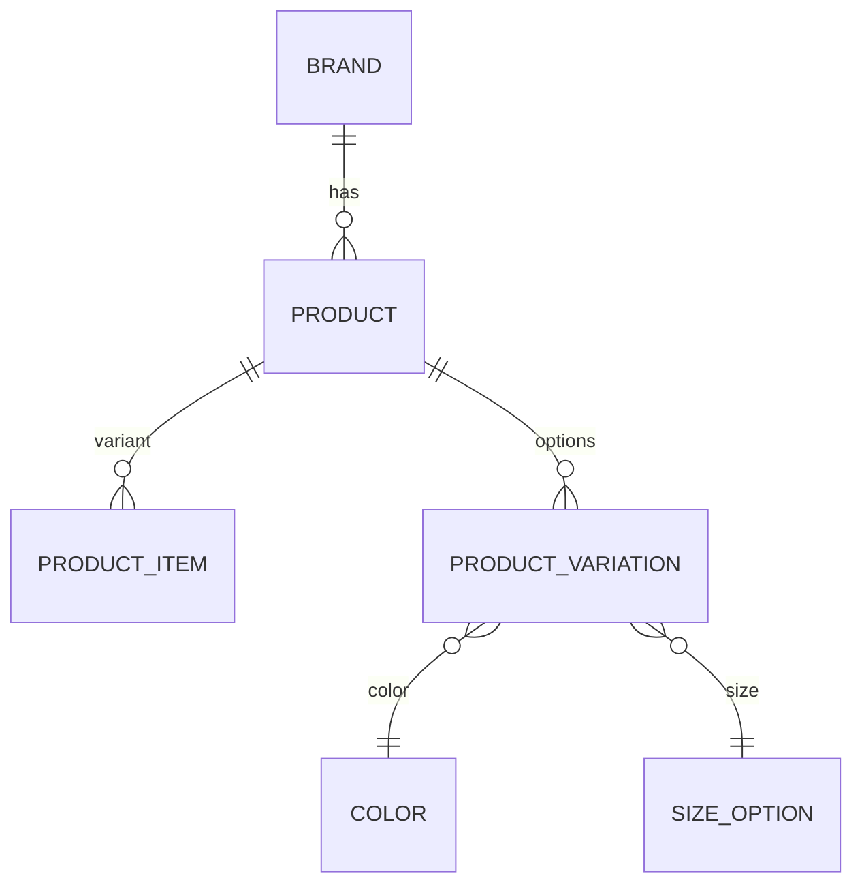

# 🛍️ E-Commerce Database System

  
*Created with [draw.io]

## 📦 Database Features
- **Multi-vendor** product management
- **Inventory tracking** at variant level (size/color)
- **Extensible attributes** system (text/number/boolean)
- **Hierarchical categories** with unlimited nesting
- **Digital asset management** for product images

## 🗄️ Schema Overview


## 🚀 Quick Start

### 1. Database Setup
```bash
# PostgreSQL
createdb ecommerce
psql ecommerce < sql/schema.sql

# MySQL
mysql -u root -p ecommerce < sql/schema.sql
```

### 2. Sample Queries
**Get all products with variants:**
```sql
SELECT p.name, pi.sku, c.name as color, s.value as size
FROM product p
JOIN product_item pi ON p.id = pi.product_id
LEFT JOIN product_item_variation piv ON pi.id = piv.product_item_id
LEFT JOIN product_variation pv ON piv.variation_id = pv.id
LEFT JOIN color c ON pv.color_id = c.id
LEFT JOIN size_option s ON pv.size_option_id = s.id;
```

**Product search with attributes:**
```sql
SELECT p.name, pa.name as attribute, pa.value_text
FROM product p
JOIN product_attribute pa ON p.id = pa.product_id
WHERE pa.attribute_category_id = 3  -- e.g. 'Technical Specs'
  AND pa.value_number > 100;
```

## 🔌 API Integration
```javascript
// Example Express.js endpoint
app.get('/api/products/:id/variants', async (req, res) => {
  const variants = await db.query(`
    SELECT pi.id, pi.price, pi.stock, 
           json_agg(json_build_object(
             'type', pv.variation_type,
             'color', c.name,
             'size', s.value
           )) as options
    FROM product_item pi
    JOIN product_item_variation piv ON pi.id = piv.product_item_id
    JOIN product_variation pv ON piv.variation_id = pv.id
    LEFT JOIN color c ON pv.color_id = c.id
    LEFT JOIN size_option s ON pv.size_option_id = s.id
    WHERE pi.product_id = $1
    GROUP BY pi.id
  `, [req.params.id]);
  
  res.json(variants);
});
```

## 🛠️ Development Tools
| File | Purpose |
|------|---------|
| `dbml/schema.dbml` | DBML source for dbdiagram.io |
| `drawio/erd.xml` | Draw.io editable diagram |
| `sql/migrations/` | Versioned SQL migrations |

## 🌐 API Reference
| Endpoint | Method | Description |
|----------|--------|-------------|
| `/products` | GET | List all products |
| `/products/:id/variants` | GET | Get product variants |
| `/inventory` | POST | Update stock levels |

## 🔄 Team Workflow
```mermaid
graph TD
    A[Clone Repo] --> B[Create Feature Branch]
    B --> C{Make Changes}
    C -->|DBML| D[Update schema.dbml]
    C -->|SQL| E[Add migration]
    D --> F[Generate new ERD]
    E --> G[Test Locally]
    F --> H[Submit PR]
