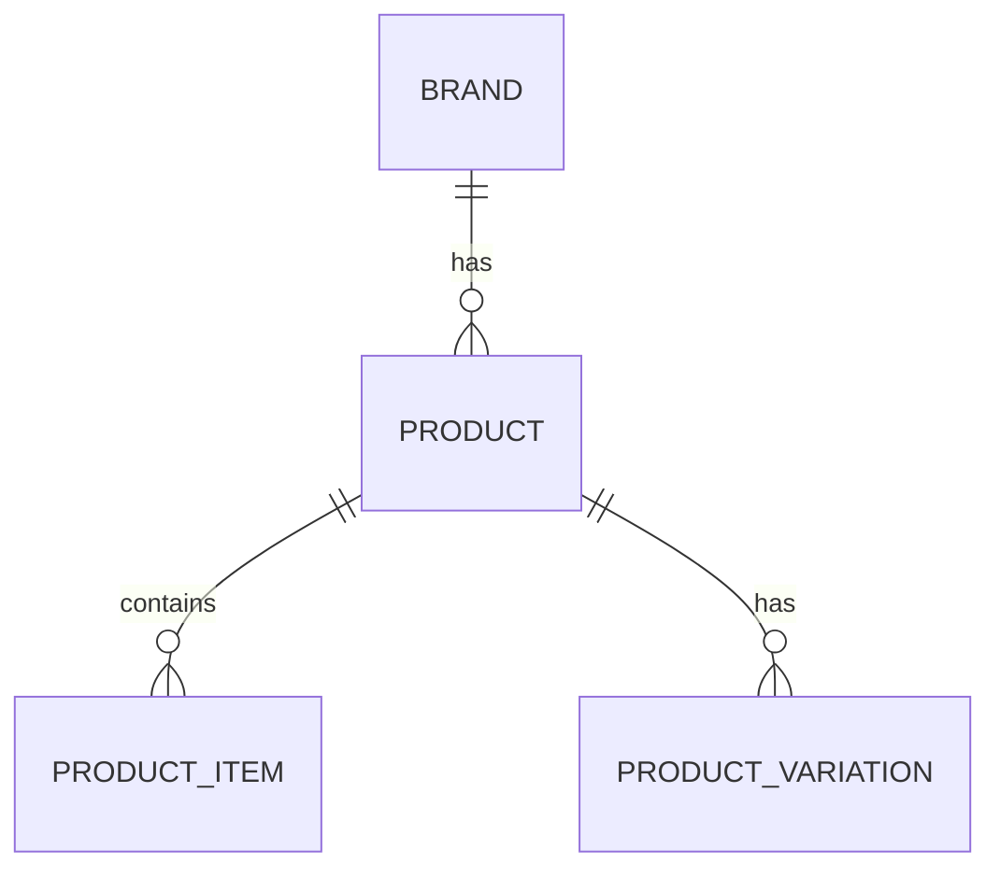

# E-Commerce Database Design

 <!-- Add your diagram image here -->

## Overview
A comprehensive database design for an e-commerce platform, featuring product management, variations, attributes, and inventory tracking.

## Database Schema
### Core Tables
| Table | Description |
|-------|-------------|
| `brand` | Stores brand information |
| `product` | Main product details |
| `product_item` | Purchasable variants |
| `product_category` | Product classification |

### Variation System
| Table | Description |
|-------|-------------|
| `product_variation` | Links products to variations |
| `color` | Available color options |
| `size_option` | Size options (S/M/L) |
| `size_category` | Size groupings |

### Media & Attributes
| Table | Description |
|-------|-------------|
| `product_image` | Product photos |
| `product_attribute` | Custom attributes |
| `attribute_type` | Data types for attributes |
| `attribute_category` | Attribute groupings |

## Key Features
- **Flexible Product Variations**: Support for size/color combinations
- **Multi-level Categories**: Hierarchical categorization
- **Extensible Attributes**: Custom specifications system
- **Inventory Tracking**: Stock management at variant level

## Installation
1. **Using draw.io**:

2. **Using dbdiagram.io**:
   
## Relationships

## Team Collaboration
1. Clone repository
2. Use `erd_design.xml` for draw.io
3. Make changes in feature branches
4. Submit PR for review

## Export Options
- **SQL**: PostgreSQL, MySQL, SQLite
- **Images**: PNG, SVG, PDF
- **Interactive**: HTML embed
